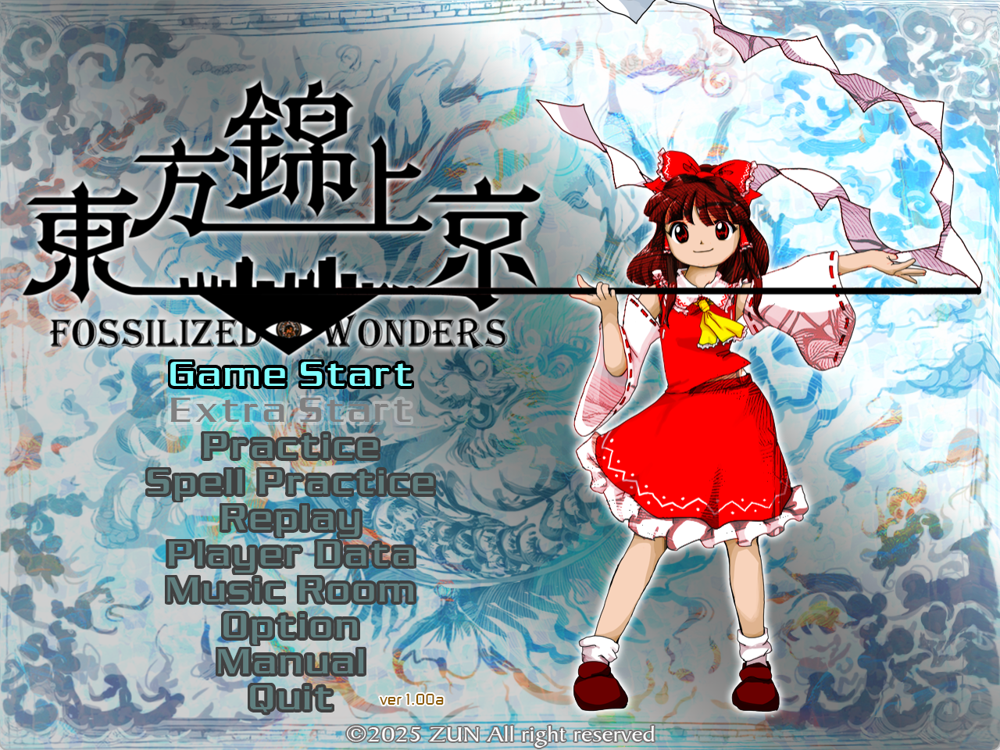
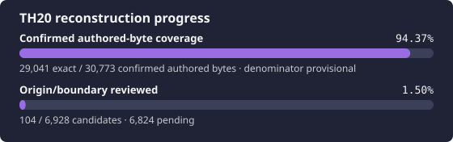

# 東方錦上京 ～ Fossilized Wonders.

<p align="center">
  
</p>

<p align="center">
  
</p>

Source reconstruction of the original Japanese TH20 v1.00a **Steamless**
executable. Function-level exactness requires reproducible comparison against
one hash-attested target. The workflow follows [TH095](https://github.com/N0zoM1z0/th095),
with Ghidra and a separate modern MSVC environment for TH20.

> [!IMPORTANT]
> Reconstruction is in progress. Verified source components and exact function
> comparisons are available; the repository does not yet build a playable game.
> Origin review, source presence, exactness, linkage and runtime behavior are
> separate statuses.

## Exact target

Supply your own executable as `resources/th20.exe`:

| Property | Required value |
| --- | --- |
| Version | Japanese 1.00a, user-selected Steamless variant |
| Embedded title/replay label | 1.00c; recorded separately from registry/package identification |
| Size | `1,858,560` bytes |
| SHA-256 | `a274b45fe6ec53511718bb328c2ff169a74e67f95d1b0c74d97d348b955a0897` |
| MD5 | `e7ccdbd2f319ba868ce386e484fff1d3` |
| Image base | `0x00400000` |
| Entry point | `0x005435E0` |

```bash
scripts/import-target.sh /path/to/th20.exe
scripts/repo-python scripts/verify-target.py
```

The Steam-original backup is retained locally as provenance evidence. Its
code differs from the comparison target. See [target provenance](docs/TARGET_PROVENANCE.md)
for official Japanese release and independent executable identification.
Game executables, assets, private databases, toolchains and reference checkouts
are excluded from Git.

## Repository status

| Area | Current position |
| --- | --- |
| Target and analysis | Locked executable; independent, fully attested Ghidra 12.1.3 project |
| Inventory | 6,928 provisional candidates; origin and boundary review in progress |
| Source | 796 mapped component functions; 781 canonical units across 153 comparison objects; fifteen whole methods remain nonexact |
| Progress-file parser | Complete parser executes actual checksum/cipher/decoder/allocator and backup merge; checksum80 is exact, parser813/native824 remains nonexact; [evidence](docs/PROGRESS_FILE_PARSE_RECONSTRUCTION.md) |
| Progress-file I/O | 10 whole exact entries; complete serialization and parsing add 2,022 bytes with independent relocation and EH evidence; [file protocol](docs/PROGRESS_FILE_IO_RECONSTRUCTION.md), [exact evidence](docs/PROGRESS_FILE_EXACT_RECONSTRUCTION.md) |
| Archive/resource I/O | 21 whole exact roots; actual File/archive/allocator/cipher/LZSS pipeline; [evidence](docs/ARCHIVE_RESOURCE_EXACT_RECONSTRUCTION.md) |
| Scheduler and hit-owner cores | Actual shared ownership, pool/heap lifecycle and complete update/draw dispatch; seven more whole exact roots add 2,769 bytes; [core evidence](docs/CORE_ITERATION_EXACT_RECONSTRUCTION.md), [hit lifecycle](docs/HIT_CONTROLLER_LIFECYCLE_RECONSTRUCTION.md) |
| Bomb ownership and dispatch | Actual base/controller storage, enabled registration, virtual lifetime and typed Context publication; 17 whole exact roots add 1,272 bytes; whole creator remains nonexact; [evidence](docs/BOMB_OWNER_RECONSTRUCTION.md) |
| Player/SHT consumer | Complete Player/Overlay value construction, SHT relocation and global cap selection; 12 whole exact roots add 1,810 bytes; original owner lifetime/activation remain open; [evidence](docs/PLAYER_SHT_RECONSTRUCTION.md) |
| Damage-query consumers | 13 new whole exact roots add 980 bytes; actual Shot/Enemy search, score/frame/flag protocols and Overlay forwarding; whole query remains private and nonexact; [evidence](docs/DAMAGE_QUERY_PROTOCOL_RECONSTRUCTION.md) |
| Item pool and reward protocol | Complete 1,536-slot owner construction/destruction, 596-byte pool initializer, Context publication, disabled scheduling and bulk-spawn/reward consumers; 16 whole exact roots add 2,195 bytes; original frame callbacks remain open; [evidence](docs/ITEM_OWNER_RECONSTRUCTION.md) |
| Primary Item spawn | Complete 1,576-byte main function and eight real dependencies add 1,830 disjoint exact bytes; actual pools, bonus/RNG recursion and binding order; original ANM VM and full link/runtime remain open; [evidence](docs/ITEM_MAIN_RECONSTRUCTION.md) |
| Item activation, effect and retirement | Complete Item lifecycle and actual Effect/Stone interfaces; 11 new physical roots add 1,096 exact bytes; whole update/draw and original resource lifetime remain open; [evidence](docs/ITEM_UPDATE_RECONSTRUCTION.md) |
| Mesh deformation | 22 whole exact protocol roots including mesh lifetime and surface creation; grid creation and complete enemy consumer remain nonexact; actual geometry/strip/lifetime checks; [evidence](docs/RENDER_MESH_RECONSTRUCTION.md) |
| Authored exactness | 94 functions, 30,383 bytes |
| Reference review | All 6,945 indexed implementation bodies reviewed; all 113 parser-gap files manually reconciled |
| Library comparisons | Four MSVC minstd_rand component equivalents pass exact replay; excluded from authored totals |
| Shared float view | Three exact comparisons; enclosing owner and origin review remain open |
| Empty/defaulted lifetime contributions | Three exact comparisons; authored versus compiler-synthesized origin remains open |
| Configuration initializers | Two exact comparisons; authored versus compiler-synthesized origin remains open |
| Window contributions | Flags initialization and foreground wrapper pass exact replay; origin remains open |
| Sound preload and loading | Complete 1,146-byte preload and 835-byte load plus three real supports add 2,152 exact bytes; actual resource/failure protocol; stream/factory/thread runtime remains open; [evidence](docs/SOUND_PROTOCOL_RECONSTRUCTION.md) |
| Audio state construction | Three complete exact record constructors; authored versus compiler origin remains open |
| Animation handle construction | Complete 23-byte exact value constructor; authored versus compiler origin remains open |
| ANM lifetime and reset | Actual Base/Animation construction, nontrivial destruction, partial reset and inherited extents: 10 whole units / 2,870 comparison bytes; [evidence](docs/EXACT_ANIMATION_LIFETIME_RECONSTRUCTION.md) |
| Vector arithmetic | Sixteen complete exact Vector2/Vector3 members; original class spelling and authored/library origin remain open |
| Timer construction and wrappers | Nine additional complete exact members, including fractional age and signed <=; source spelling and origin review remain open |
| Colored vertex construction | Complete 43-byte exact constructor for the actual 20-byte value; source spelling and origin review remain open |
| Trophy messages | Exact shared-buffer decoder and typed record reset; full resource/parser/owner lifetime remains open |
| Archive codec and allocation | Signed decrypt, persistent LZSS/tree and actual byte/array/PMR allocation: 16 new units / 2,676 bytes; [evidence](docs/EXACT_ARCHIVE_CODEC_RECONSTRUCTION.md) |
| Archive writing protocol | Complete446-byte encryption is exact; whole compressor964/native1036 executes real codec/parser roundtrips and remains nonexact; [evidence](docs/ARCHIVE_WRITE_RECONSTRUCTION.md) |
| Worker lifetime | Real thread start/replacement, guarded join/detach and destructor: 5 new units / 666 body bytes; [evidence](docs/EXACT_WORKER_RECONSTRUCTION.md) |
| Shared locks and random stream | Node construction/access, actual recursive-mutex registry and locked seed/next: 9 new units / 693 body bytes; [evidence](docs/EXACT_LOCK_RANDOM_RECONSTRUCTION.md) |
| Intrusive observation and Region lifetime | Shared link/list/iterator protocol and Region construction/update: 20 new units / 1,827 body bytes; [evidence](docs/EXACT_INTRUSIVE_LIFETIME_RECONSTRUCTION.md) |
| Motion update protocol | Two complete main updates and direct angle/vector/math dependencies: 18 new units / 2,572 comparison bytes; [evidence](docs/EXACT_MOTION_RECONSTRUCTION.md) |
| Rectangle/segment geometry | All 12 related roots plus 9 direct dependencies: 21 new complete units / 10,759 bytes; [evidence](docs/EXACT_RECTANGLE_COLLISIONS_RECONSTRUCTION.md) |
| Collision geometry | Circle/ellipse/polygon/star predicates and vector dependencies: 10 new complete units / 3,841 bytes; [evidence](docs/EXACT_COLLISION_SHAPES_RECONSTRUCTION.md) |
| Enemy interpolation | Current-first 2.4 KB update, shared/axis factors and direct movement dependencies: 8 new units / 2,716 bytes; [evidence](docs/EXACT_ENEMY_INTERPOLATION_RECONSTRUCTION.md) |
| Enemy state and ECL entry | Complete state lifetime, typed records and argument-forwarding protocol: 11 new units / 1,581 bytes; whole Enemy dispatcher pending; [evidence](docs/EXACT_ENEMY_STATE_RECONSTRUCTION.md) |
| State/Manager script pipeline | Whole script gate and async traversal with actual member callback and Timer step: 3 new units /419 bytes; [evidence](docs/EXACT_ENEMY_SCRIPT_PIPELINE_RECONSTRUCTION.md) |
| ECL buffer pipeline | Actual borrowed-buffer registration and instruction resolution now execute in VM/Manager tests; both remain nonexact. Player Context binding is whole exact; [evidence](docs/ECL_BUFFER_RECONSTRUCTION.md) |
| Profile construction | Complete 13,684-byte typed constructor with 123 physical Spell slots and full EH; [evidence](docs/EXACT_PROGRESS_PROFILE_RECONSTRUCTION.md) |
| Snapshot and Metadata | Whole constructors with real eighteen-profile array, fallback and nine-slot counters: 2 units /755 comparison bytes; [evidence](docs/EXACT_PROGRESS_STORAGE_RECONSTRUCTION.md) |
| SaveManager and member tasks | Actual two-Snapshot owner, owned member callbacks and complete record merge: 5 whole units /463 bytes; lifecycle roots remain nonexact; [evidence](docs/EXACT_PROGRESS_SAVE_MANAGER_RECONSTRUCTION.md) |
| ECL async and call setup | Whole spawn/find/invalidation, Runtime allocation and Loader activation; real VM lifecycle checks: 7 new units /524 bytes; [evidence](docs/EXACT_ECL_ASYNC_RECONSTRUCTION.md) |
| Enemy spawn and time-scale orchestration | Two complete Enemy core functions and Animation slowdown setter: 3 new units /1399 comparison bytes; [evidence](docs/EXACT_ENEMY_SPAWN_TICK_RECONSTRUCTION.md) |
| Enemy movement and construction | Whole movement composition/bounds, mode configuration and nonthrowing Enemy construction: 9 new units / 1,285 body bytes; [evidence](docs/EXACT_ENEMY_MOVEMENT_RECONSTRUCTION.md) |
| Whole Enemy movement update and graphics owners | Complete movement update and actual Graphics/viewport/configuration/file/context construction: 15 new units / 4,215 comparison bytes; [evidence](docs/EXACT_ENEMY_UPDATE_RECONSTRUCTION.md) |
| ECL resource lifetime and loading | Actual base/derived owner lifetimes and whole 556-byte file loading: 9 new units / 934 bytes; [lifetime](docs/EXACT_ECL_RESOURCE_LIFETIME_RECONSTRUCTION.md), [loading](docs/EXACT_ECL_FILE_LOADING_RECONSTRUCTION.md) |
| ECL argument and tagged stack protocol | Whole current instruction, eleven parameter/destination members and generic push/pop/peek: 15 new units / 2,886 bytes; [evidence](docs/EXACT_ECL_ARGUMENT_STACK_RECONSTRUCTION.md) |
| Enemy writable variables and handles | Whole integer/float destinations, checked selection, identifier resolution and actual Data/array construction: 6 new units / 1,820 body bytes; [evidence](docs/EXACT_ENEMY_VARIABLE_RECONSTRUCTION.md) |
| ECL runtime lifetime and async disposal | Complete zero-state construction, real PMR/virtual cleanup and destroy-before-lock scalar release: 10 new units / 701 body bytes; [evidence](docs/EXACT_ECL_RUNTIME_LIFETIME_RECONSTRUCTION.md) |
| Process Session and player table | Actual 704-byte process owner, CRT initializer, two Contexts/two PlayerRecords, lookups and state queries: 20 new units / 1,177 comparison bytes; [evidence](docs/EXACT_SESSION_RECONSTRUCTION.md) |
| Controller and Task construction | Actual 308-byte Controller defaults, native Task flag construction and generation side effects: 2 new units / 385 comparison bytes; [evidence](docs/EXACT_CONTROLLER_CONSTRUCTION_RECONSTRUCTION.md) |
| Card construction and time state | Actual 200-byte Card, typed handles, wrapping time encoding, full-width validation and Context binding/lookup: 6 new units / 730 comparison bytes; [evidence](docs/EXACT_CARD_RECONSTRUCTION.md) |
| Player storage construction | Actual Option/Feedback/Shot/ShotController and complete 256-shot pool: 7 whole constructors / 1,494 comparison bytes; [evidence](docs/EXACT_PLAYER_STORAGE_RECONSTRUCTION.md) |
| Game construction and state | Actual 272-byte GameInf, typed Configuration/Timers/doubles, full-width flag queries and restart: 5 whole units / 367 comparison bytes; [evidence](docs/EXACT_GAME_CONTROLLER_RECONSTRUCTION.md) |
| Interpolation protocol | Shared 4 KB easing and eight typed updates, plus direct dependencies: 32 new units / 13,952 comparison bytes; [evidence](docs/EXACT_INTERPOLATION_RECONSTRUCTION.md) |
| Whole-program build and runtime | Not available |

[Generated progress](docs/PROGRESS.md) and `scripts/report-reconstruction-status.py`
are the canonical live totals. The authored-byte denominator covers only the
currently reviewed set; it is not whole-game completion.

The pinned compiler candidate is MSVC `19.44.35211` x86, with Windows SDK
`10.0.26100.0` and D3DX `9.29.952.8`. Clean `/Od` C++20 profiles reproduce the
accepted components. These results do not establish executable-wide compiler
flags, SDK or CRT identity. Profiles and relocation anchors are recorded per
source in `config/match-units.toml`.

## Build and verify

Public checks need Python 3.11+ and a C++20 compiler, with no original game or
proprietary toolchain:

```bash
scripts/repo-python scripts/ci.py
```

Private reconstruction checks:

```bash
scripts/bootstrap-tools.sh
scripts/repo-python scripts/verify-target.py
scripts/repo-python scripts/report-reconstruction-status.py --summary
scripts/repo-python scripts/validate-tracking.py --require-target
scripts/repo-python scripts/ghidra.py check
scripts/repo-python scripts/replay-exact-units.py
```

On a fresh private workspace, provision tools as described in
[Tools](docs/TOOLS.md), then run `scripts/repo-python scripts/ghidra.py import` once.
Every query re-attests the executable and complete mapped code section;
inventory refreshes never overwrite reviewed ledgers.

## Reference review

[Oracatt/Touhou20](https://github.com/Oracatt/Touhou20) is pinned locally under
ignored `_reference/Touhou20`. Its target hash matches ours. Its v1.00c label
comes from embedded strings; our v1.00a identification follows the independent
hash registry and supplied package. Both observations are preserved in provenance.

The [review](docs/REFERENCE_REVIEW.md) records the repository-wide evidence audit,
module dispositions, stale reports and independently verified absorption.
Validated source diagnostics route further analysis; reference source, build
layout and completion claims are not imported wholesale.

The [function-by-function review](docs/REFERENCE_FUNCTION_REVIEW.md) is complete
for all 6,945 indexed implementations, including one parser omission recovered
during manual review. All 113 parser-gap files are manually reconciled. The
[final audit](docs/REFERENCE_SUPPORT_REVIEW.md) records coverage and evidence
limits; nonexact implementations remain documented for further reconstruction.

## Documentation

- [Current handoff](docs/RE_HANDOFF.md)
- [Architecture and target inventory](docs/ARCHITECTURE.md)
- [Reconstruction workflow](docs/RE_WORKFLOW.md)
- [Independent oracles](docs/ORACLES.md)
- [Build and strict matching](docs/BUILD_MATCHING.md)
- [Ghidra setup and attestation](docs/GHIDRA.md)
- [Tool routing](docs/TOOLS.md)
- [Source ownership](docs/SOURCE_MAP.md)
- [Semantic reconstruction policy](docs/SEMANTIC_RECONSTRUCTION.md)
- [Reference review](docs/REFERENCE_REVIEW.md)
- [Function-by-function reference review](docs/REFERENCE_FUNCTION_REVIEW.md)
- [Complete reference review and final tooling batch](docs/REFERENCE_SUPPORT_REVIEW.md)
- [Enemy movement, spawn and variable review](docs/REFERENCE_ENEMY_MOVEMENT_REVIEW.md)
- [Runtime invincibility launcher](docs/RUNTIME_PATCH.md)
- [Verified knowledge base](docs/KNOWLEDGE_BASE.md)
- [Roadmap](docs/ROADMAP.md)
- [Generated progress](docs/PROGRESS.md)
- [Agent rules](AGENTS.md)

## Credits

- [Oracatt/Touhou20](https://github.com/Oracatt/Touhou20): reference
  reconstruction, source diagnostics and behavioral investigations that guide
  our independent, function-by-function review.
- [N0zoM1z0/th095](https://github.com/N0zoM1z0/th095): reconstruction workflow,
  exact-oracle control plane, tracking conventions and README/progress layout.

## License

[MIT](LICENSE) for this repository's original code and TH095-derived control
plane. It grants no rights to the original game, downloaded tools or external
reference material. Maintained prose and commit messages are in English;
official names and original target evidence retain their original language.
